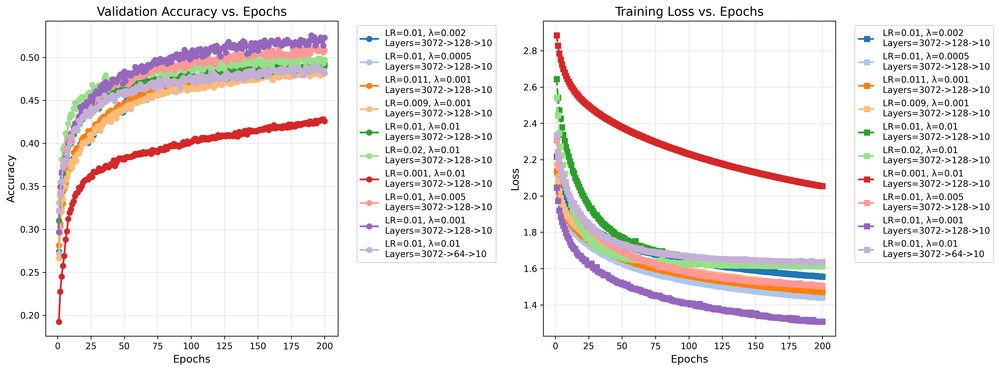
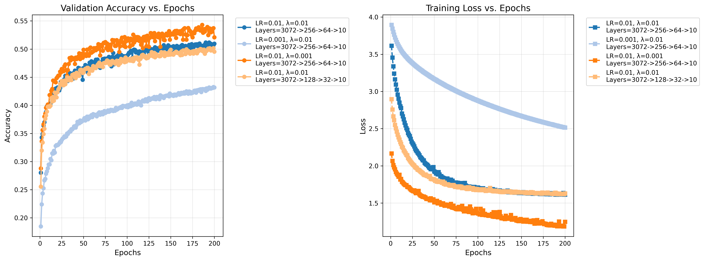
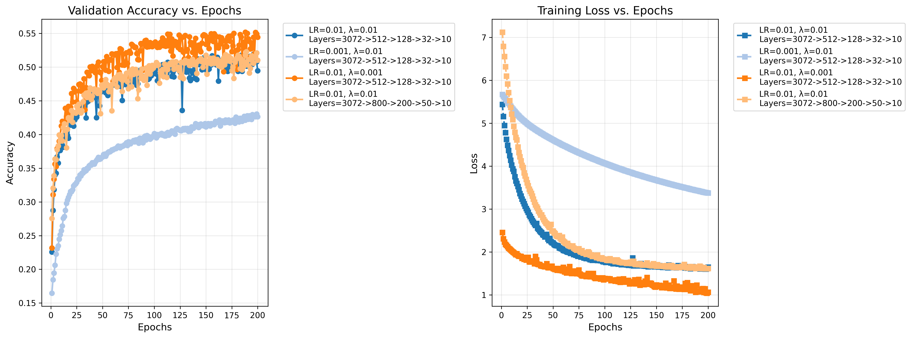

# 从零开始构建三层神经网络分类器，实现图像分类

[Github Public Repo](https://github.com/fdijia/pj1)

## 模型定义
- def __init__(self, layer_sizes=[3072, 256, 64, 10], activations='relu', learning_rate=0.01, reg_lambda=0.01, model_name=None)
  这是一个输入层-自定义隐藏层层数及大小-输出层的神经网络
  layer_sizes: 层，是一个列表，如果没有指定, 默认是[3072, 200, 60, 10]，要包含输入尺寸和输出尺寸
  activations: 激活函数, 可以是一个字符串（自动认为所有层都是该函数）, 也可以是一个列表，如果没有指定，默认是都是'relu'，层数与layer_sizes对应
  model_name: 模型名称, 训练好的模型会根据名称加上各参数保存, 通过后面定义的编码和解码函数确定，注意如果要使用已有的模型，请直接输入模型的名字而不带路径，模型储存在models文件夹下
  如果给了函数名则各参数由函数名决定， 否则由各参数决定
  如果没有现有模型则随机生成W b进行初始化
- def forward(self, X)
  前向
- def backward(self, X, y, learning_rate)
  反向
- def evaluate_model(self, X, y)
  评估准确率
- def compute_loss(self, y_pred, y_true)
  交叉熵损失和L2正则化损失

## 模型训练
- def train_model(model, X_train, y_train, epochs=100, batch_size=64) -> losses_history, val_acc_history
  先将传入参数9：1分为训练集和验证集，在打乱数据每次训练batch_size个数据量，一共训练epochs次，每次训练都计算训练集上的损失和验证集上的准确率，并取准确率最好的一次训练作为最终模型，训练结束后将模型保存在models下以模型名称命名的.npz文件内，并返回损失记录和准确率记录
- 模型训练在parasFinding.py中进行，此时会以组为单位保存训练时的各数据以及测试集上的准确率，放在visualization文件夹下，同时里面还有数据可视化
- 要获取各个模型的测试集上的准确率只需运行evaluateModel.py，能自动读取文件夹中所有模型并输出准确率以及各模型文件计算测试机准确率，可自行调整

## 实验结果
- 隐藏层层数越多，训练相同的epoch次数，准确率越高，但都在0.5-0.6之间，隐藏层越大，训练效果最好
- 初始learning_rate较高时训练较快，正则化系数越小训练程度越好
- 只看一层隐藏层，根据实验learning_rate=0.01, reg_lambda=0.001训练效果最好，当训练200epochs时，测试集上准确率为0.5178

## 模型可视化
- 一层隐藏层

- 二层隐藏层

- 三层隐藏层

- 最终模型
